---

## 👋 About Me

> 🚀 Backend Engineer | Python | Django

I build **production-ready backend systems**, **developer tools**, and **scalable infrastructure**. Creator of [djboost](https://pypi.org/project/djboost/) — a PyPI-published CLI for Django.

- 🔧 Building **[djboost](https://github.com/munjurdev/djboost)** — Production CLI for Django (PyPI published)
- 📚 Maintaining **[deployment-guide](https://github.com/munjurdev/deployment-guide)** — Real-world deployment knowledge
- 🎯 Focus: **Clean Architecture** · **API Design** · **CI/CD** · **Developer Experience**

### 🌱 Currently Exploring

`Kubernetes` `Infrastructure as Code` `System Design` `Multi-tenancy` `Event-driven Architecture`

---

## 💻 Tech Stack

| Category | Technologies |
|:---------|:-------------|
| **Backend** | `Python` · `Django` · `Django REST Framework` |
| **Databases** | `PostgreSQL` · `MySQL` |
| **Cache & Messaging** | `Redis` |
| **Background Tasks** | `Celery` · `Celery Beat` |
| **Realtime** | `WebSockets` · `Django Channels` |
| **DevOps & CI/CD** | `Docker` · `Nginx` · `Linux` · `GitHub Actions` · `GitLab CI/CD` |
| **Cloud & Infrastructure** | `AWS` · `Kubernetes` · `Infrastructure as Code` |

             

---

## 📌 Featured Projects

<table>
<tr>
<td width="50%">

### 🚀 [djboost](https://github.com/munjurdev/djboost)
Production CLI for Django — scaffolding, features, and deployment.

**What it does:**
- Generate production-ready Django projects in seconds
- 17+ modular features (Docker, K8s, Celery, GraphQL)
- Safe add/remove engine with dry-run & auto-rollback

</td>
<td width="50%">

### 📚 [deployment-guide](https://github.com/munjurdev/deployment-guide)
Real-world Django deployment knowledge base.

**What it covers:**
- VPS setup, Django production, Nginx, PostgreSQL
- Docker, Kubernetes, AWS, CI/CD pipelines
- Security hardening, monitoring, troubleshooting

</td>
</tr>
</table>

---

## 📊 GitHub Stats

---

## 🔥 GitHub Streak

---

## 📈 Activity Graph

<!-- 🔄 Auto-replaced with actual graph after first GitHub Action run -->

📋 <b>How it works</b>

 

> This graph updates automatically every 12 hours via GitHub Actions.
> It shows your coding activity over the last 31 days.

---

## 🏆 Achievements

<!-- ✏️ EDIT: Check your profile at https://github.com/munjurdev and keep only earned badges -->
<!-- 📝 Tiers: Replace -default with -bronze, -silver, or -gold -->

📋 <b>How it works</b>

 

> **Auto-update:** This section updates automatically every Sunday via GitHub Actions.
>
> **Manual update:** You can also trigger it manually from the Actions tab.
>
> **Customization:** Edit `scripts/check-achievements.sh` to add/remove badges.
>
> **Common achievements:**
> - **Pull Shark** — merged 2+ pull requests
> - **Starstruck** — repo with 16+ stars  
> - **Quickdraw** — closed issue/PR within 5 minutes
> - **YOLO** — merged PR without code review

---

## 📫 Connect With Me

### 💼 Let's Work Together!

I'm currently **open to freelance projects**, **full-time opportunities**, and **open-source collaborations**.

Feel free to reach out — I'd love to hear from you!

---

*"Clean code, solid architecture, reliable systems."*

